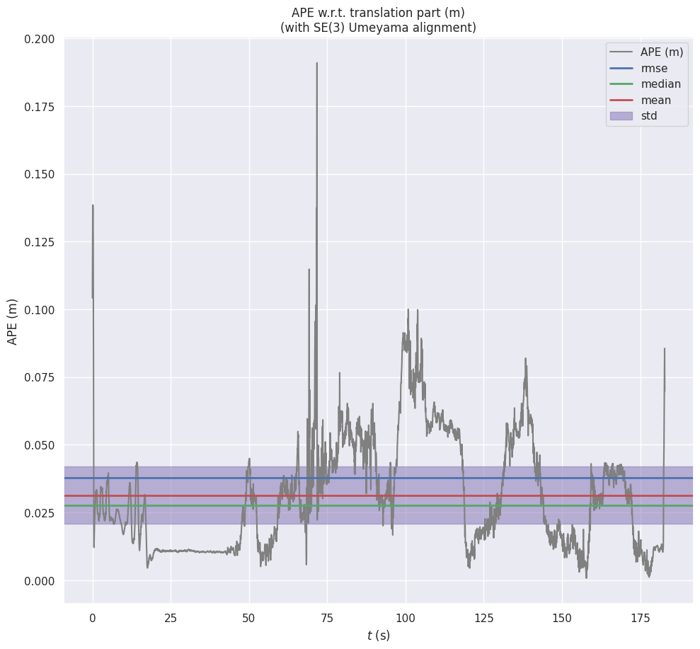
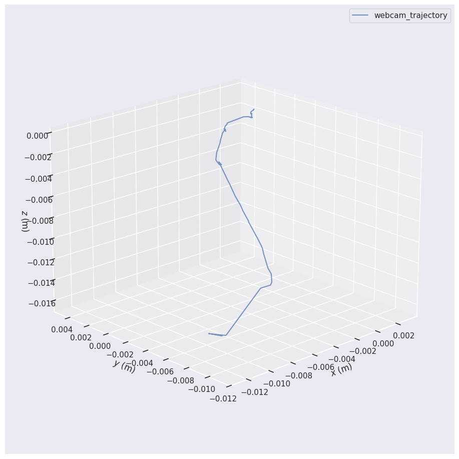

# Visual SLAM with ORB-SLAM3

Real-time Visual Simultaneous Localization and Mapping using ORB-SLAM3, demonstrated on the EuRoC MAV benchmark dataset and live laptop webcam.

## System Specs
| Component | Details |
|-----------|---------|
| CPU | Intel Core Ultra 7 255HX |
| GPU | NVIDIA RTX 5060 8GB |
| RAM | 32GB |
| OS | Ubuntu 22.04 + ROS2 Humble |

## Results

### EuRoC MH01 Stereo - Absolute Trajectory Error (ATE)
| Metric | Value |
|--------|-------|
| RMSE | **3.78 cm** |
| Mean | 3.14 cm |
| Median | 2.76 cm |
| Max | 19.09 cm |

### Live Webcam Demo
Real-time monocular SLAM using integrated laptop camera — 112 keyframes tracked across 153 seconds.

## Demo

### EuRoC Dataset (Stereo)


### Live Webcam SLAM


## Project Structure
```
├── ORB_SLAM3/          # ORB-SLAM3 source (submodule)
├── Pangolin/           # Visualization library (submodule)
├── config/             # Camera calibration configs
├── datasets/           # EuRoC/KITTI datasets (not tracked)
├── results/            # Trajectory outputs and plots
├── scripts/            # Evaluation and runner scripts
│   ├── run_orbslam3_euroc.sh      # EuRoC dataset runner
│   ├── run_webcam_slam.sh         # Live webcam runner
│   └── evaluate_trajectory.py    # ATE/RPE evaluation
└── examples/           # Custom examples (webcam)
```

## Setup & Run

### Dependencies
```bash
sudo apt install libopencv-dev libeigen3-dev libglew-dev libboost-all-dev
```

### Build Pangolin
```bash
cd Pangolin && mkdir build && cd build
cmake .. -DBUILD_PANGOLIN_PYTHON=OFF
make -j$(nproc) && sudo make install
```

### Build ORB-SLAM3
```bash
cd ORB_SLAM3 && chmod +x build.sh && ./build.sh
```

### Run on EuRoC Dataset
```bash
export LD_LIBRARY_PATH=./ORB_SLAM3/lib:./ORB_SLAM3/Thirdparty/DBoW2/lib:./ORB_SLAM3/Thirdparty/g2o/lib:$LD_LIBRARY_PATH
bash scripts/run_orbslam3_euroc.sh stereo MH01
```

### Run Live Webcam
```bash
bash scripts/run_webcam_slam.sh
```

### Evaluate Trajectory
```bash
bash scripts/evaluate_trajectory.sh
```

## Key Concepts Demonstrated
- ORB feature extraction and matching
- Stereo visual odometry
- Bundle adjustment with g2o
- Loop closure detection with DBoW2
- Absolute Trajectory Error (ATE) benchmarking
- Real-time 3D map visualization with Pangolin

## References
- [ORB-SLAM3 Paper](https://arxiv.org/abs/2007.11898) - Campos et al., IEEE T-RO 2021
- [EuRoC Dataset](https://projects.asl.ethz.ch/datasets/euroc-mav/) - Burri et al., IJRR 2016
